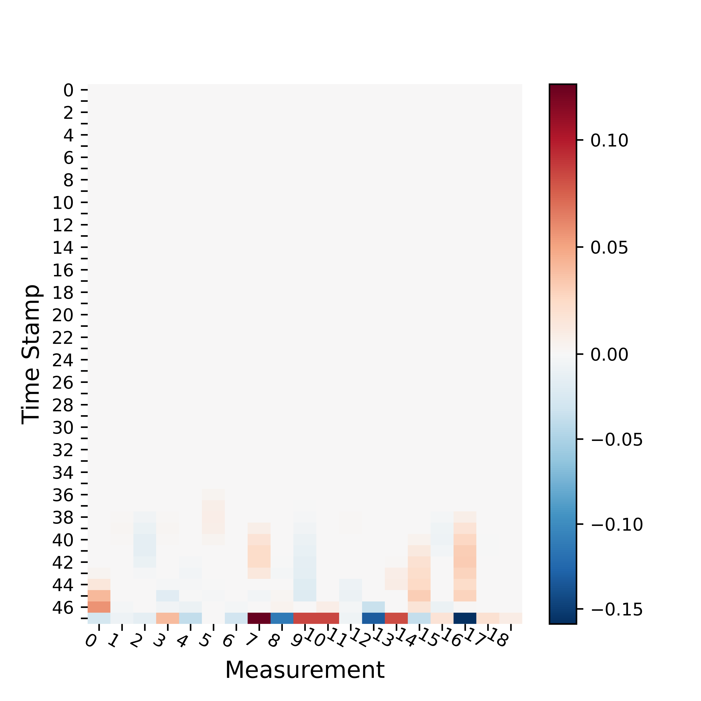
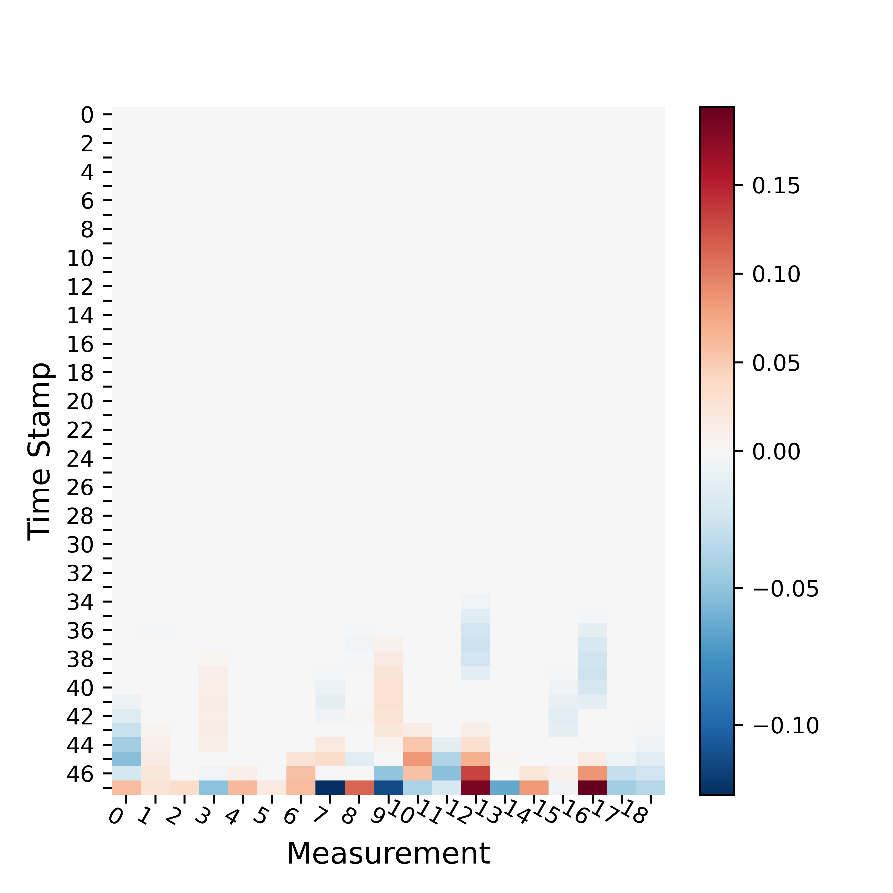
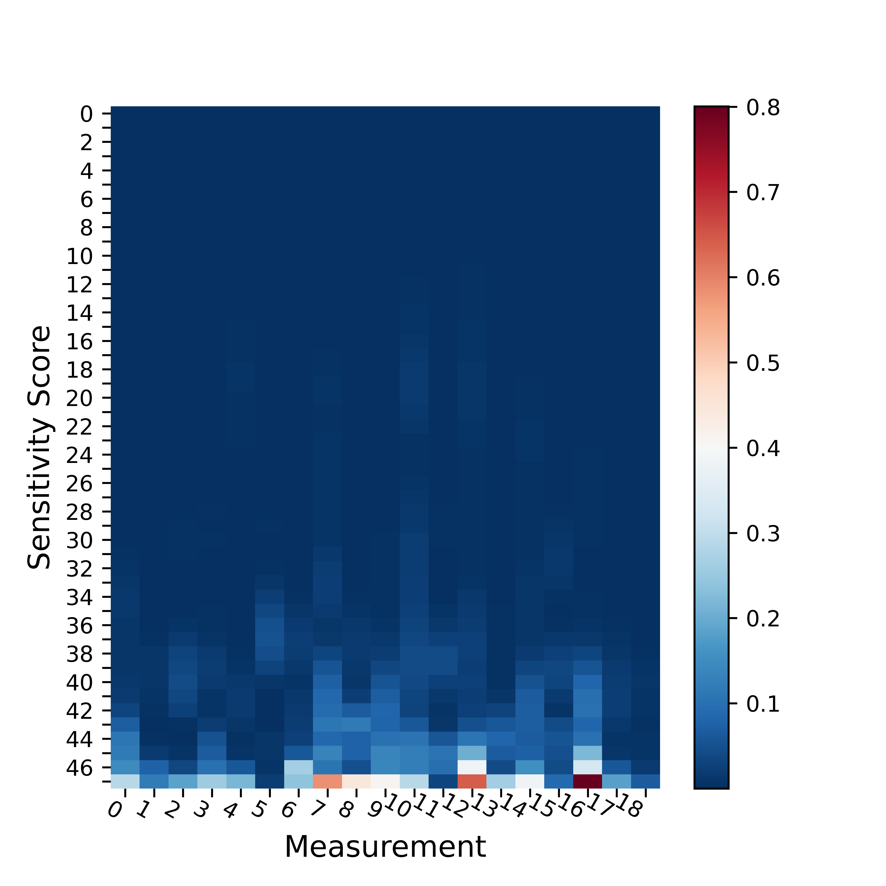

# UIUC CS598DLH Reproducibility Project

## Reproducing [Identify Susceptible Locations in Medical Records via Adversarial Attacks on Deep Predictive Models](https://arxiv.org/abs/1802.04822)

Cite: Sun, Mengying, et al. "Identify susceptible locations in medical records via adversarial attacks on deep predictive models." Proceedings of the 24th ACM SIGKDD international conference on knowledge discovery & data mining. 2018.

## Dependencies

The code is compatible with TF2. 
Specifically TensorFlow 2.8.0 should be able to run the code.
You would also need to install matplotlib for drawing the figures.

## Introduction

This project is to reproduce [Identify Susceptible Locations in Medical Records via Adversarial Attacks on Deep Predictive Models](https://arxiv.org/abs/1802.04822). 


## Data Download Instructions
We provide the preprocessed dataset. To train the LSTM model mentioned in the paper, you can use the following sampled data (provided by the author).
You would need an @illinois.edu account to access the [data](https://drive.google.com/file/d/1BPwtfLnRe4bgKQ439eANFxKDvnkzgDNH/view?usp=sharing). 

## Preprocessing
Code for preprocessing is not given by the original paper author.

## Training and generate adversarial noise

We don't provide pretrained models since training can be done using CPU within hours.
To train the code with default parameters:
```
python main.py --data_folder <path_to_downloaded_dataset>
```
This would generate multiple temporary files containing information about the adversarial noise.
The files would be used in the next step.
 
## Generate Figures

To draw the figures presented in our report:
```
python draw.py
```
The names of the output figures starts with the figure number in the original paper for reference.

## Example Results

The typical model performance you would get after training is:

|             |  AUC        | F1          | Precision   | Recall     |
| ----------- | ----------- | ----------- | ----------- |----------- |
| Original      | 0.9094       | 0.5429      | 0.4100       |0.8071       |
| Ours      | 0.9058       | 0.5232      | 0.3924       |0.7848       |

Then after generating the graphs you should be able to see the following:

The two typical adversarial patterns,
1) Changing output label 0 to 1:



2) Changing output label 1 to 0:



And the sensitivity score distribution (0 to 1):



Please refer to our report for more figures and discussions.

## Project Layout
- [mimic3gen](mimic3gen): This folder contains our data cleaning and extraction efforts. 
- main.py: Train the target model (LSTM). The code references the original repo below and is made compatible in TF2. We follow the structure of the original code for clarity. This will output multiple files 
- draw.py: Drawing the figures.

## Reference

- [The original but incomplete repo, med-attack](https://github.com/illidanlab/med-attack)

